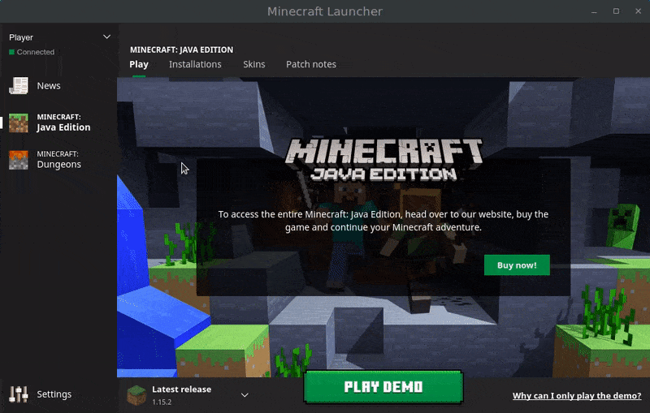

# Minecraft Spoofer 

## Usage:

0) Download and install [original Minecraft launcher](https://www.minecraft.net/download).
1) Download the executable file for your operating system ([Windows](https://github.com/egormkn/minecraft-spoofer/releases/latest/download/minecraft-spoofer-windows.exe) / [Linux](https://github.com/egormkn/minecraft-spoofer/releases/latest/download/minecraft-spoofer-linux) / [MacOS](https://github.com/egormkn/minecraft-spoofer/releases/latest/download/minecraft-spoofer-osx)).
2) Set it as Java executable for Minecraft installation in your launcher:

   
   
3) Launch the game!
